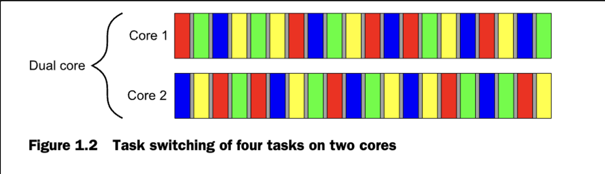

# 1장. Hello, world of concurrency in C++!

이 장에서는 다음을 다룹니다:

- 동시성과 멀티스레딩의 의미
- 당신이 동시성과 멀티스레딩을 당신의 애플리케이션에 적용하고 싶은 이유
- C++ 동시성 지원의 역사(여기서는 다루지 않습니다.)
- 간단한 멀티스레드 C++ 프로그램의 생김새

## 동시성이란 무엇인가?

가장 간단하고 기본의 레벨에서, 동시성은 둘 또는 이상의 활동이 동시에 이루어지는 것을 말한다.

우리는 동시성을 삶의 부분에서 마주한다.

우리는 걷고 동시에 말을 할 수 있으며, 각 손으로 다른 행동이 가능하다.

그리고 우리는 각자 다른 일을 할 수 있다.

당신은 축구 경기를 볼 수 있고, 나는 수영을 갈 수 있듯이 말이다.

### 컴퓨터 시스템에서의 동시성

컴퓨터에서의 동시성은, 한 시스템이 서로 독립적인 활동을 순차적이 아닌, 동시에 구동함을 말한다.

새로운 현상이 아니다.

멀티태스킹 운영체제는 하나의 컴퓨터가 태스크 스위칭이 수년간 편해져서 여러 개의 애플리케이션을 동시에 실행하도록 해준다.

그리고 진작에 여러 프로세서를 가진 고성능의 서버 장비는 진실로 동시에 작업을 수행할 수 있도록 되었다.

새로워진 것은 병렬 처리이다. 많은 컴퓨터들이 가짜로 동시에 움직이는 것처럼 동작하는 것이 아닌 병렬로 작업을 할 수 있게 되었다.

역사적으로, 대부분의 컴퓨터들은 하나의 코어에서 하나의 프로세서만을 가지고, 오늘날에도 많은 컴퓨터들이 여전히 그렇다.

그러한 컴퓨터들은 한 순간에 하나의 작업만을 할 수 있지만, 1초에서 많은 작업들을 바꿀 수 있었다.

이렇게 작업들을 바꾸면서 처리하면, 작업이 동시에 처리되는 것과 같이 보인다.

이를 task switching이라 한다.

우리는 여전히 동시성(concurrency)을 시스템인 것처럼 말한다. Task switching이 너무 빠르기 때문에, 어느 지점에서 프로세서가 switching을 하는지에 대해서 알 수 없기 때문이다.

Task switching은 사용자와 애플리케이션에게 동시성의 환상, 즉 동시성처럼 움직임을 제공한다.

동시성의 환상이기 때문에, 싱글 프로세서의 task switching을 통한 애플리케이션의 행동은 진짜 동시에 실행되는 것과는 미묘하게 다르다.

특히, 메모리 모델에 대한 부정확한 가정이 진짜 동시에 실행되는 환경에서는 나타나지 않을 것이다.

10장에서 자세히 다룰것이다.

여러 프로세서를 가진 컴퓨터들은 서버와 고성능 컴퓨팅에 지난 수년간 사용되어왔다.

데스크탑에서도 여러 프로세서와 코어를 가지고 나오고 있다.

데스크탑에서 여러 프로세서 또는 코어, 또는 둘다일때, 이 컴퓨터는 하나의 작업을 실제로 평행으로 실행가능하다.

우린 이것을 hardware concurrency라고 부를 것이다.

그림 1.1은 컴퓨터에 정확이 두 개의 작업이 10개의 같은 크기의 청크로 나눠진 이상적인 시나리오를 보여준다.

듀얼코어 머신에서는, 각 작업이 각 코어에서 실행된다.

싱글코어 머신에서는, 작업 청크를 인터리빙한다.

그러나, 그들은 잠시 멍을 때린다.(그림에서의 회색바를 주목하라)

인터리빙을 위해서, 매 시간 시스템은 context switch를 한다.

Context switch를 수행하기 위해서, OS는 CPU의 상태와 현재 task의 지시문에 대한 포인터를 저장하고, task를 전환해서 작업한 뒤, CPU 상태를 되돌린다.

CPU는 지시문, 데이터, 캐시에 있는 새로운 task - 무분별한 task의 실행을으로 시간지연이 나는 상황을 방지하는 등을 잠재적으로 끌어와야 한다.


하드웨어에서의 동시성이 멀티코어나 멀티프로세서와 함께 더 명백함에도, 일부 프로세서들은 하나의 코어에서 다중 스레드를 가질 수 있다.

진짜 중요한 것은, 하드웨어 스레드의 개수 - 실제 하드웨어가 정말 동시에 실행할 수 있는 독립적인 태스크의 수 이다.

시스템이 진정으로 hardware concurrency를 가진다고 해도, 실제 하드웨어 스레드보다 많은 양의 처리를 해야 할 때가 있다.

예를 들어, 특정 데스크톱 컴퓨터는 수백개의 실행 중, 백그라운드 실행 등의 task를 유휴 상태(idle)에서도 이용할 수도 있다.

task switching은 워드프로세서, 컴파일러, 편집기, 웹브라우저를 동시에 실행할 수 있게 해준다.

그림 1.2는 듀얼코어 머신에서의 청크의 크기가 정확히 같은 4가지 태스크를 다루는 이상적인 모습이다.

실제로는 스케줄링이 대부분 불균형적이다.



이 책에서 다루는 모든 기술, 함수 및 클래스는 애플리케이션이 단일 코어 프로세서를 가진 컴퓨터에서 실행되는 다중 코어 프로세서를 가진 컴퓨터에서 실행되든 사용할 수 있으며, 동시성이 태스크 스위칭을 통해 이루어지든 실제 하드웨어 동시성을 통해 이루어지든 영향받지 않는다.

8장에서 C++에서 동시성 코드를 설계할 때 고려할 문제들을 설명한다.

### 성능을 위해 동시성 사용하기

멀티프로세서 시스팀은 수십년 간 존재해왔다.

그러나 슈퍼컴퓨터, 메인프레임, 대형 서버 시스템에서만 그랬다.

그러나 칩 제조자들은 멀티코어 디자인을 2, 4, 16, 그 이상의 프로세서를 하나의 칩에 넣기 시작했다.

결론적으로, 멀티코어 데스크톱 컴퓨터, 멀티코어 임베디드장치 등은 흔해졌다.

이러한 머신들의 상향된 컴퓨팅 파워는 하나의 작업을 빨리 하는 것은 아니지만, 동시에 여러 작업들을 처리할 수 있게 해주었다.

과거에는, 프로그래머들은 프로그램이 빨라지기 위해서는 프로세서가 새 세대가 나오길 기다려야 했지만, 

요즘은 공짜 점심은 없다.

소프트웨어가 상향된 성능을 가지게 하기 위해서, 여러 일들을 동시에 할 수 있어야 한다.

프로그래머들은 주의를 기울이고, 동시성을 그들의 도구상자에 넣어야 한다.

동시성에 대한 두 가지 방법이 있다.

1. 하나의 작업을 평행하게 나누어서 각각 돌리기
→ 총 런타임을 줄일 수 있다.
이를 task parallelism이라고 한다.
이는 복잡한 절차일 수 있다.
그들의 의존성이 여러 부분으로 나뉠 수 있기 때문이다.
처리의 종류로 나눠질 수 있다. 하나의 스레드는 알고리즘의 한 부분을 수행하고, 다른 스레드는 다른 부분을 수행한다. 이들은 다른 공간에서 수행된다.
이것을 data parallelism이라 한다.
이러한 병렬 처리에 적합한 알고리즘은 굉장히 병렬적인(embrrassingly parallel)알고리즘이라고도 불린다.
코드가 병렬화하기 매우 쉬워서 당황할 수도 있겠지만,. 이는 좋은 것이다.
병렬적인 알고리즘은 우수한 확장성(scalability) 특성을 갖고 있다. 즉, 사용가능한 하드웨어 스레드와 소프트웨어 스레드가 증가함에 따라 알고리즘의 병렬성을 이에 맞게 증가할 수 있다.
이러한 알고리즘은 ‘백지장도 맞들면 낫다’라는 속담을 구현한다.
알고리즘의 일부가 굉장히 병렬적이지 않은 경우, 알고리즘을 고정된 수의 병렬 작업으로 나눌 수 있을 것이다.


2. 사용 가능한 병렬성을 활용하여 더 큰 문제 해결하기
한 번에 하나의 파일을 처리하는 대신, 적절하게 2개, 10개, 또는 20개의 파일을 처리하는 것이다.
데이터 병렬성의 응용일 뿐이지만, 여러 데이터 집합에 동시에 동일한 작업을 수행함으로써 다른 초점을 가진다. 하나의 데이터 링크를 처리하는 데 동일한 시간이 걸리지만, 이제 동일한 시간 내에 더 많은 데이터를 처리하게 된다.
물론 여기에도 한계가 있다. 모든 상황에서 효율적이지 않다.
그러나 이러한 처리량 증가로 새로운 가능성이 열릴 수 있다.
영상처리에서 서로 다른 영역을 병렬로 처리한다면, 해상도를 높이는 것이 가능하다.

### 동시성을 사용하면 안되는 경우

동시성을 쓰면 안되는 경우를 알아두는 것도 중요하다.

근본적으로, 동시성을 쓰면 안되는 이유는 이익이 비용보다 적을 때이다.

동시성을 쓰는 코드는 이해하기 어렵다. 멀티스레드를 쓰는 코드에 대한 작성과 유지보수에 대해 지적인 비용이 들고 더 많은 버그를 불러올 수 있다.

잠재적 성능향상이 멀티스레드 코드를 유지보수한는데 쓰이는 시간과 비용에 적합하지 않으면, 동시성을 사용하지 마라.

또한, 성능이 생각보다 늘어나지 않는다. 스레드를 실행하는 데에는 오버헤드가 생긴다. OS가 커널 자원과 스택 공간, 새 스레드를 스케줄러에 할당하는 비용이 생긴다.

만약 테스크가 빨리 끝난다면, 실제 시간은 오버헤드 때문에 더 소요될 것이다.

스레드 생성은 전체적인 성능향상에 오히려 악영향을 줄 수도 있다.

더 나아가고, 스레드는 한정된 자원이다.

만약 당신이 스레드를 너무 많이 실행시키면, OS자원을 소모하여 모든 시스템을 느리게 만들 수 있다.

그 뿐만이 아니라, 너무 많은 스레드의 사용은 프로세스의 메모리 공간을 고갈시킨다.

각 스레드는 분리된 스택 공간을 요구하기 때문이다.

32비트 프로세서에서 4GB의 주소 공간밖에 없는 경우, 특히나 치명적이다.

이 경우에서, 만약 스레드가 1MB 스택공간을 가지고, 주소 공간이 4096 스레드를 코드나 정적 데이터, 힙 데이터에 대한 공간 없이 할당된다.

비록 64비트 프로세서는 이러한 직접적인 주소 공간의 한계를 가지지는 않지만, 그들의 자원도 유한한다.

만약 스레드를 너무 많이 사용하면, 이는 문제가 된다.

비록 thread pools가 스레드의 수의 제한을 하더라도, 이는 무적이 아니다.(원어: not silver bullet)

그리고 그들은 그만의 문제가 있다.

만약 클라이언트/서버 애플리케이션에서 서버사이드가 각각의 커넥션을 가진 분할된 스레드를 실행하면, 이는 적은 수의 연결로는 괜찮다. 그러나 스레드를 너무 많이 실행하면서 고성능 서버가 많은 커넥션을 가져야 하는 상황에서 같은 기술이 쓰이는데, 이는 시스템 자원을 빠르게 소모할 것이다. 

이 상황에서, thread pools로 최적의 성능을 제공시킬 수 있다.

마지막으로, 더 스레드를 더 많이 쓸수록, 더 많은 context switching을 OS가 수행해야 한다는 뜻이다.

각 conetxt switch는 유용한 작업을 수행할 수 있다는 시간을 차지하기에, 일정 시스템에서는 스레드 추가가 오히려 더 성능저하일 수도 있다.

이는 애플리케이션의 성능에 중요한 부분에서 측정 가능한 이득이 있을 것이라는 가능성에만 가치가 있다.

## 시작하기

C++11 컴파일러가 있다고 합시다.

C++ 멀티스레드 프로그램은 어떻게 생겼을까?

다른 C++ 프로그램과 같아 보인다, 변수, 클래스, 그리고 함수들의 조합이다.

진짜 다른 부분은 일부 함수는 동시에 실행된다는 것이다.

당신은 공유된 데이터에 대한 동시 접근을 안전하게 하도록 보장해야 한다.

함수를 동시에 실행하려면, 특정 함수와 객체가 서로 다른 스레드들을 관리하도록 해야 한다.

### Hello, Concurrent World

간단한 예시부터 시작해보자.

`Hello World`를 찍는 것이다.

이 프로그램이 하는 것은 `Hello World`를 stdout 스트림에 출력하는 것 뿐이다.

```cpp
#include <iostream>
#include <thread>

void hello() {
    std::cout << "Hello Concurrent World\n";
}

int main() {
    std::thread t(hello);
    t.join();

    return 0;
}
```

`#include <thread>`: 멀티스레딩을 지원하는 C++ 라이브러리이다.

스레드를 다루는 함수와 클래스들이 담겨있다.

공유 데이터를 접근하는 데에 대한 제한은 다른 헤더에 담겨 있다.

함수를 하나 더 만들어서 `hello`를 찍었다.

모든 스레드는 진입점이 되는 함수가 필요하다..

`main()`이 메인 스레드의 진입점이라고 볼 수 있다.

모든 다른 스레드에 대해서는 `std::thread` 객체의 생성자가 필요하다.

이 경우에는 `std::thread`의 객체인 t는 `hello()`를 시작 함수로 한다.

새 스레드가 생기고 나서, 최초의 스레드는 실행을 계속한다.

만약 새로운 스레드를 기다리지 않는다면, 새 스레드가 뭔가를 하기 전에 main()함수의 끝에 와서 프로그램을 종료할 것이다.

그래서, 우리는 `join()`을 실행했다. 이는 호출된 스레드 객체가 끝날때까지 기다리는 것이다.

여기서는 t를 기다린다.

표준출력에 메시지를 남기기까지 많은작업이 수행된 것 같지만, 사실 위 같이 단순한 상황은 다중 스레드를 쓸 이유가 없다.

다중 스레드를 사용하는 것이 도움이 되는 상황을 추후에 지켜보자.