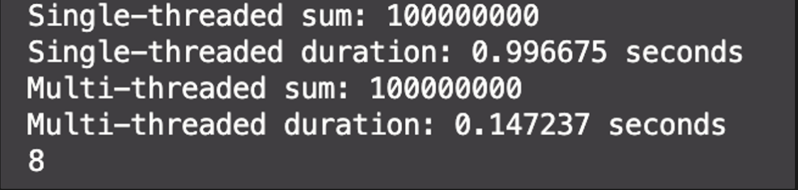

# 2장. Managing Threads

어떻게 스레드를 실행하고, 어떻게 이들이 끝났는지 확인할 수 있을까?
C++ STL은 대부분의 스레드 관리를 비교적 쉽게 해준다.
모든 것이 `std::thread` 객체에 연관되어있다.
이러한 작업들이 똑바르진 않지만, 라이브러리는 기본적인 빌드에 필요한 유연함들을 제공한다.

이 챕터에서는, 기본부터 시작한다.
스레드를 시작시키고, 끝나는 것을 기다리거나 백그라운드에서 동작되도록 할 것이다.
그리고, 하나의 `std::thread` 객체에서 다른 하나로 소유권을 넘기는 것에 대한 함수에 대한 추가적인 파라미터를 봐볼 것이다.

## 2.1: 기본적인 스레드 관리

모든 C++ 프로그램은 C++런타임에 쓰이는 적어도 하나의 스레드를 실행한다..
그 스레드는 `main()`을 실행하는 스레드이다.
당신의 프로그램은 다른 함수를 시작점으로 가지는 추가적인 스레드를 실행시킬 수 있다.

이러한 스레드들은 처음 스레드를 포함해서 다른 스레드들과 동시에 실행된다.
프로그램이 `main()`함수에서 반환될 때 프로그램이 종료되는 것처럼, 지정된 진입점 함수가 반환되면 스레드가 종료된다.
`std::thread` 객체가 스레드에 대해 있을 경우, 스레드가 끝날 때까지 기다릴 수 있다.

그러나, 스레드를 먼저 시작해야 하므로, 스레드를 실행하는 법을 찾아보자.

### 2.1.1: 스레드 실행하기

챕터 1에서 보았듯이, 스레드는 스레드가 실행해주길 바라는 `task`를 명시하면서 `std::thread` 객체를 생성함으로써 시작된다.
가장 단순한 경우, `task`는 아무 파라미터와 반환값이 없는 플레인한 함수이다.
이 함수는 그만의 스레드에서 리턴할때까지 실행되고, 그 뒤 스레드는 멈춘다.

반대로, task는 추가 매개변수를 받는 함수 객체일 수 있으며, 실행 중에 어떤 종류의 메시징 시스템을 통해 지정된 일련의 독립적인 작업을 수행할 수 있다.
이 경우, 스레드는 역시 어떤 종류의 메시징 시스템을 통해 종료 신호를 받을 때만 멈추게 된다.
스레드가 무엇을 할 것이고, 어디서 시작되는지는 상관없다.
C++ STL에서의 스레드 사용은, `std::thread` 객체를 생성하는 것으로 범위가 좁혀진다.

```cpp
void do_some_work();
std::thread my_thead(do_some_work);
```

간단히 하자면 위와 같다.
물론 컴파일러가 `std::thread`를 사용할 수 있도록 `<thread>`헤더를 포함해놔야 한다.
다른 많은 C++STL과 마찬가지로,  `std::thread`는 아무 호출 가능한 타입과 동작한다.
`std::thread` 생성자에 함수 호출 연산자를 가진 클래스의 인스턴스를 대신 전달할 수 있다.
```cpp
class background_task {
public:
    void operator()() const {
    do_something();
    do_something_else();
    }
};

background_task f;
std::thread my_thread(f);
```

이 경우에서, 제공된 함수 객체는 다음에 속하는 저장소(실행 스레드를 새로 만들어 그곳에서 실행됨) 으로 복사된다.
복사본은 원본과 동등하게 동작하거나, 결과가 예상치 못하게 흘러갈 수 있다.
함수 객체를 스레드 생성자에 전달할 때 고려해야 할 사항은 “C++의 가장 골치 아픈 해석”을 피하는 것이다.

만약 당신이 이름이 있는 변수가 아닌 임시 값을 넘기면, 문법은 함수 선언의 문법과 동일할 수 있으며, 이 경우 컴파일러는 개체 정의가 아닌 함수 선언으로 해석한다.

예를 들어,

```cpp
std::thread my_thread(backtround_task());
```
는 하나의 파라미터(`background_task` 객체를 반환하는 파라미터가 없는 함수 포인터)를 가진, 그리고 새로운 스레드를 시작하는 것이 아닌, 스레드 객체를 반환하는 `my_thread` 함수를 선언한다.

당신은 이전에 보인 것처럼 괄호쌍을 쓰거나 새로운 초기화 문법을 사용함으로 함수 객체에 이름을 정의하면서 해결할 수 있다.
예를 들어,

```cpp
std::thread my_thread((background_task())); // 1
std::thread my_thread{background_task()}; // 2
```

처럼 말이다.

1에서는 추가된 괄호쌍이 함수 선언의 내용을 바꾼다.
`my_thread`를 `std::thread`형의 변수의 선언으로 허용하는 것이다.
2번은, 새로운 표준 초기화 문법을 쓰는 것이다. 이도 변수의 선언으로 허용한다.

이러한 문제를 피하는 호출가능한 객체의 한 종류는 람다식이다.
C++11에 추가된 기능인데, 지역변수를 쓰고 추가적인 매개변수의 필요를 피하는 지역함수를 쓸 수 있게 해준다.
이전의 예시는 아래의 람다식으로 대체될 수 있다:

```cpp
std::thread my_thread([] {
	do_something();
	do_something_else();
});
```

당신이 스레드를 한 번 실행하면, 당신은 스레드가 완료될때까지 기다릴지(`join`), 아니면 독립적으로 실행할지(`detach`)를 명시적으로 결정해야 한다.
`std::thread`객체가 소멸되기 전에 이러한 결정을 내리지 않으면 프로그램이 종료된다.
(`std::thread` 소멸자는 `std::terminate()`를 호출한다.)
따라서, 예외 상황에서도 스레드가 올바르게 `join` 또는 `detach`되도록 보장하는 것은 필수적이다.

이 시나리오의 처리는 2.1.3에 있다.
`std::thread` 객체가 소멸되기 전에 이 결정을 내려야 한다 - 스레드 자체는 `join`하거나 `detach`하기 훤씬 전에 완료될 수 있고, 만일 당신이 `detach`한 경우, `std::thread` 객체가 소멸되고도 계속 실행될 수도 있다.

만약 당신이 스레드를 종료하는 것을 기다리지 않는다면, 당신은 스레드에 의해 접근되는 데이터가 스레드가 종료될 때까지 유효함을 보장해야 한다.

이것은 새로운 문제가 아니다.
싱글스레드의 코드에서도 객체가 없어진 후 접근하는 것은 정의되지 않은 동작이지만, 스레드를 사용할 때는 이러한 수명 문제를 겪을 더 많은 기회를 접하게 된다.
그러한 문제에 직면하는 상황들 중 하나는 스레드 함수가 로컬변수에 대한 포인터나 참조를 가지고 함수가 종료될 때에도 스레드가 종료되지 않을 때이다.

아래의 예시는 그러한 시나리오이다.

```cpp
// Listing 2.1: 
// A function that returns while a thread still has access to local variables

#include <thread>

struct func {
    int &i;
    func(int &i_) : i(i_){}

    void operator()() {
        for (unsigned j = 0; j < 1000000; ++j) {
            do_something(i);
        }
    }
};

void oops() {
    int some_local_state = 0;
    func my_func(some_local_state);
    std::thread my_thread(my_func);
    my_thread.detach();
}
```

여기서, 새로운 스레드는 `my_thread`객체와 관계가 맺어지고, `oops()`가 끝날 때에도 실행이 될 것이다.
당신은 `detach()`로 스레드를 기다리지 않기로 했기 때문이다.
스레드가 여전히 실행 중이라면, 다음 호출에서의 `do_something(i)`은 사라진 변수에 접근할 것이다.

이는 일반적인 싱글스레드 코드와 같다. 지역 변수에 대한 포인터 또는 참조 외부 함수로 넘기는 것을 허용하는 것은 좋은 아이디어가 아니다. 
멀티스레드 환경에서는 더 실수가 나기 좋다.
당장은 문제가 보이지 않기 때문이다.

이러한 시나리오를 다루는 한 일반적인 방법은 스레드 함수에서 데이터를 참조하는 것이 아닌, 데이터의 복사본을 가지고 있는 것이 좋다.
스레드 함수에 호출 가능한 객체를 사용한다면, 그 객체는 스레드에 복사된다. 기존 객체는 즉시 없어질 수 있다.
그러나 당신은 여전히 객체가 포인터 또는 참조를 가지는 것에 대해 주의하여야 한다.
[Listing 2.1]이 그런 경우이다.

특히, 함수에서 어떠한 로컬변수에 참조하는 것은 좋지 않다. 스레드가 그 스레드를 호출시킨 함수가 끝나기 전에  종료되는것이 보장되어도 말이다.
대안으로, 당신은 `join`을 통해 기존 함수가 스레드의 호출을 기다려주도록 할 수 있다.

### 2.1.2: 스레드가 완료되기까지 기다리기

만약 당신이 스레드를 기다리고 싶다면, `std::thread` 인스턴스에 연관된 `join()`을 통해서 가능하다.
[Listing 2.1]에서 `my_theread.detach()`를 `my_thread.join()`으로 대체하면, 함수가 끝나기 전에 생성된 스레드를 기다렸다가 끝낸다.
이 경우, 스레드를 분리하여 함수를 실행하는 것에는 거의 의미가 없다.
최초의 스레드는 하는 일이 없기 때문이다.

그러나 실제 코드에서는 원래의 스레드가 자체적으로 작업을 수행하거나 여러 스레드를 실행하여 모두 완료할 때까지 유용한 작업을 할 수 있다.
당신이 스레드가 끝나길 기다리던 말던, `join()`은 간단하고 무식하다(brute force).
스레드가 종료되었는지 확인하거나 일정 시간 동안만 기다리는 등 더 세밀하게 스레드 대기를 제어하려면, `조건 변수`나 `future`와 같은 대안 매커니즘을 사용해야 한다.
이는 챕터 4에서 확인할 것이다.

`join()`을 호출하는 것은 스레드와 관련된 스토리지를 정리함을 의미한다.
즉, `std::thread` 객체가 더 이상 막 끝난 스레드와 연관되지 않는다.
아무런 스레드와도 관계를 맺은 상태가 아니게 된다.
이는 주어진 스레드에 `join()`호출을 한 번만 할 수 있음을 의미한다.
만약 한번 `join()`을 호출하면, 그 스레드는 더 이상 `joinable`하지 않고, `joinable()`도 `false`를 반환할 것이다.

### 2.1.3: 예외적 상황을 기다리기

이전에 언급했는데, `std::thread`객체가 사라지기 전까지 당신은 join()또는 detach()를 호출해야 한다.
만약 `detach`하기로 했다면, `detach()`를 스레드가 시작되고나서 호출하면 된다.
이건 문제가 없다.

그러나 스레드를 기다리기로 했다면, 당신은 `join()`을 어디에서 호출해야 할지 생각해봐야 한다.
이는 스레드가 시작되고 `join()` 호출전에 예외가 발생하면 호출이 건너뛰어질 수 있다는 말이다.
당신의 애플리케이션이 예외가 발생하였을 때 종료되는 것을 방지하려면, 그러한 케이스에서 어떻게 하여야 할지 결정해야 한다.
일반적으로, 예외가 없을 때 당신이 `join()`을 호출하여 한다면, 예외 발생 시에도 `join()`을 호출하여 우발적인 수명문제를 해결해야 한다.

아래 코드는 간단한 예제이다.

```cpp
// Listing 2.2
// Waiting for a thread to finish

struct func; // Listing 2.1을 참고하세요.

void f() {
    int some_local_state = 0;
    func my_func(some_local_state);
    std::thread t(my_func);
    try {
        do_something_in_currnet_thread();
    } catch (...) {
        t.join();
        throw;
    }
    t.join();
}
```

[2.2]에서의 코드는 함수가 일반적으로 끝날 경우이던, 예외가 발생하던, `try/catch` 블록으로 로컬 상태에 기존 함수가 끝나기 전에 접근할 수 있도록 보장해준다.
`try/catch`블록의 사용은 방대하고, 범위를 잘못 알기 쉽다. 이는 이상적인 시나리오가 아니다.

만약 로컬변수에 대한 참조가 있는 등, 스레드가 함수 종료 전에 끝나는 것을 보장하는 것이 중요하다면, 일반적인 상황이던, 예외적인 상황이던 모두 가능한 종료 경로에 대해 스레드가 해당하는지 확인하는 것이 중요하고, 이를 위해 간결한 매커니즘을 제공하는 것이 좋다.

하나의 방법은 표준 `RAII(Resource Acquistion Is Initialization)` 원칙을 사용하고 클래스에게 제거될 시 join()을 하도록 하는 것이다.

아래 예처럼 말이다.
함수 `f()`가 어떻게 간소화되었는지 보자.

```cpp
// Listing 2.3: 
// Using RAII to wait for a thread to complete

class thread_guard {
    std::thread& t;
public: 
explicit thread_guard(std::thread& t_): // 생성자 선언
    t(t_)
    {}
    ~thread_guard() // 소멸자 선언
    {
        if(t.joinable()) {
            t.join();
        }
    }
    thread_guard(thread_guard const&) = delete;
    thread_guard& operator = (thread_guard const&) = delete;
};

struct func; // Listing 2.1 참고

void f() {
    int some_local_state = 0;
    func my_func(some_local_state);
    std::thread t(my_func);
    thread_guard g(t);

    do_something_in_current_thread();
}
```

실행 중에서 현재 스레드의 실행이 f의 끝에 도달했을 때, 로컬 객체들은 생성의 반대 순서로 제거된다.
`thread_guard` 객체가 먼저 제거되고, 소멸자가 실행되면서 `thread`가 `join`되기까지 기다린다.

이는 함수 도중에도 일어날 수 있다. `do_something_int_current_thread`가 예외를 발생시킬 수 있기 때문이다.
[2.3]의 `thread_guard`의 소멸자는 처음에 `join()`을 호출하기 전에 `std::thread`객체가 `joinable()`한지 확인한다.
이는 중요하다. `join()`은 한 번만 실행 가능하기 때문이다. 그래서 이미 `join()`되었을 경우, 오류가 날 수도 있다.

복사 연산자와 대입 연산자는 컴파일러에 의해 자동적으로 제공되는 것을 방지하기 위해서 `=delete`로 되어 있다.
객체에 복사 또는 대입은 위험할 수 있다. 예상치 못한 변경이 생길 수도 있기 때문이다.

`deleted`로 선언하면서, `thread_guard()` 객체에 대한 복사 시도는 컴파일 에러를 불러일으킨다.
만약 `thread`가 끝나는 것을 기다릴 필요가 없다면, 당신은 예외로부터 안전한 이슈를 피하기 위해 `detach`할 수 있다.
이는 스레드와 `std::thread`의 관계를 없애고, `std::thread` 객체가 없어질 때 `std::terminate()`가 호출되지 않게 한다. 스레드가 백그라운드에서 여전히 실행 중일떄도 말이다.

### 2.1.4: 백그라운드에서 스레드 실행시키기

`detach`를 `std::thread`객체로 실행하는 것은  아무것도 그와 통신할 수 없이 스레드를 백그라운드에 실행되도록 둔다는 뜻이다.
이제 그 스레드가 끝날 때까지 기다리는 것은 불가능하다.
만약에 스레드가 `detach`되면, `std::thread`객체가 참조할 수 없어진다. 더이상 `join()`할 수도 없다.

`Detach`된 스레드들은 백그라운드에서 실행되고, 소유권과 제어권은 스레드와 관련된 자원들이 스레드가 종료될 때 확실히 정리될 수 있도록 C++ 런타임 라이브러리로 넘어간다.
Datach된 스레드는 UNIX에서 명백히 유저 인터페이스 없이 백그라운드에서 실행되는 `daemon process`라는 개념 이후에,  `daemon threads`라고도 불린다.

그러한 스레드들은 보통 오래 지속된다.그들은 애플리케이션의 생명주기 동안 전체적으로 켜져 있다.
파일시스템 모니터링, 객체 캐시에서 안쓰이는 엔트리 정리, 또는 자료구조 정리 등의 백그라운드 작업 등을 실행하면서 말이다.

반대로, 스레드가 완료된 시점이나 스레드가 “실행 후 무시(fire and forget)” 작업에 사용되는 위치를 식별하는 다른 매커니즘이 있는 분리된 스레드를 사용하는 것이 합리적일 수 있다.

섹션 2.1.2에서 보았듯이, 당신은 스레드를 멤머 함수 `detach()`를 통해서 `std::thread` 객체와 detach시켰다.
그 call이 실행되고는, 더 이상 `std::thread` 객체는 그 실제 실행중인 스레드와 관련이 없고, 그러므로 `joinable()`하지 않다.

```cpp
std::thread t(do_background_work);
t.detach();
assert(!t.joinable());
```

`std::thread`객체로부터 스레드를 `detach`하기 위해서는, `detach`할 스레드가 있어야 한다. 연관이 없는 `std::thread` 객체에는 `detach()`함수를 쓸 수 없다.

join()에서의 요구사항과 같다. 그리고 당신은 `t.detach()`를 `t.joinable()`이 `true`일 때만 사용가능하다.

워드프로세서 애플리케이션이 있고 많은 문서들을 한번에 편집한다고 해보자.
UI계층과 내부 양 측에서, 다루는 방법은 다양한다.
보편적인 한 방법은 편집되는 각 문서에 대해 하나의 여러 개의 독립적인 최상위 창을 가지는 것이다.
비록 이 창들이 각각의 고유한 메뉴가 존재하는 등 완전히 독립적으로 보여도, 동일한 애플리케이션 인스턴스 내에서 실행되고 있다.

내부적으로 이를 다루는 한 방법은 각 문서 편집 창에 하나의 스레드를 가지는 것이다. 각 스레드는 같은 코드를 가지지만, 창의 특성에 따라서 편집되는 각자 다른 데이터를 가진다.
새로운 문서를 여는 것은 새로운 스레드를 켜는 것을 말한다. 요청을 처리하는 스레드는 다른 스레드가 끝나는 것을 기다릴 필요가 없다. 관련이 없는 문서이기 때문이다. 그러므로, 분리된 스레드를 실행하는 새로운 후보를 만들어준다.

아래의 Listing은 예제를 보여준다.

```cpp
// Listing 2.4: 
// Detaching a thread to handle other documents

void edit_document(std::string const& filename) {
    open_document_and_display_gui(filename);
    while(!done_editing()) {
        user_command cmd = get_user_input();
        if(cmd.type == open_new_document()) {
            std::string const new_name = get_filename_from_user();
            std::thread t(edit_document, new_name);
            t.detach();
        } else {
            process_user_input(cmd);
        }
    }
}
```

만약에 사용자가 새 문서를 열면, 당신은 문서를 열라고 명령을 내린다. 새로운 스레드에게 그 문서를 열라고 하는 것이다. 그리고 `detach`시킨다.
새 스레드는 다른 파일에서 현재 스레드와 같은 혁할을 하기 때문에, 당신은 새롭게 지정된 파일 이름을 인자로 받아서 똑같은 함수를 재사용 가능하다. (`edit_document` 같은)
이러한 예시는 스레드를 시작할 때 함수에 인자를 전달할 때 유용하다.
생성자에서 함수를 줄 뿐만 아니라, 이름까지 주었다.

매개변수가 있는 일반함수 대신 멤버 데이터가 있는 함수 개체를 사용하는 등 다른 매커니즘을 사용할 수 있지만, 스레드 라이브러리를 사용하면 쉽게 작업할 수 있다.

## 2.2: 스레드 함수에 인자 전달하기
[Listing 2.4]에서처럼, `std::thread`의 생성자에 호출가능한 객체 또는 함수를 인자로 주는 것은 간단하다.
그러나 함수의 매개변수가 참조를 기대하는 경우에도 인자는 기본적으로 내부 저장소로 복사되며, 새로 생성된 실행 스레드에서 액세스할 수 있다.
다음은 간단한 예시이다:

```cpp
void f(int i, std::string const &s);
std::thread t(f, 3, "hello");
```

이는 스레드 객체인 t와 연관된 새로운 스레드를 만들어서 `f(3, “hello”)`를 실행시킨다.
`f`가 `std::string`을 두 번째 매개변수로로 받음을 주목하다. 문자열 리터럴은 `char const*`로 전달되고, 새로운 스레드에서만 `std::string`으로 변환된다.
매개변수가 다음과 같이 자동 변수에 대한 포인터로 제공될 때, 이는 특히 중요하다.

```cpp
void f(int i, std::string const &s);

void oops(int some_param) {
    char buffer[1024];
    sprinf(buffer, "%i", some_param);
    std::thread t(f, 3, buffer);
    t.detach();
}
```

이 경우에서, 로컬변수 `buffer`에 대한 포인터는 새로운 스레드로 전달된다.
그리고 함수 `oops`는 버퍼가 새로운 스레드에 std::string으로 변환하는 동안 종료할 특정 기회가 생긴다.
이는 정의되지 않은 행동으로 옮겨진다.
솔루션은, `std::thread` 생성자에 전달하기 전에 `std::string`으로 변환해서 주는 것이다.

```cpp
void f(int i, std::string const &s);

void not_oops(int some_param) {
    char buffer[1024];
    sprinf(buffer, "%i", some_param);
    std::thread t(f, 3, std::string(buffer));
    t.detach();
}
```

이러한 경우에서, `std::thread` 생성자가 예상되는 인수 유형으로 변환하지 않고 제공된 값을 그대로 복사하기 떄문에, 버퍼에 대한 포인터를 함수 매개변수로 예상되는 std::string객체로 암묵적으로 변환하고 있다는 게 문제이다.

시나리오를 거꾸로 갈 수도 있다.
객체가 복사되고, 참조를 원하는 경우이다.
만약 스레드가 참조받은 자료 구조를 업데이트 하려 할 때이다.
예를 들어서, 

```cpp
void update_data_for_widget(widget_id w, widget_data &data);

void oops_again(widget_id w) {
    widget_data data;
    std::thread t(update_data_for_widget, w, data);
    display_status();
    t.join();
    process_widget_data(data);
}
```

비록 `update_data_for_widget`이 참조를 예상하지만, `std::thread`의 생성자는 알 수 없다.
함수에서 예상되는 인자의 유형을 무시하고 제공된 값을 맹목적으로 복사한다.
`update_data_for_widget`이 실행될 때, 데이터 자체에 대한 참조가 아닌, 복사본에 대한 참조를 전달하게 된다.

결론적으로, 스레드가 종료될 때, 업데이트 값은 사라질 것이다.
그리고 `process_widget_data` 역시 업데이트 된 데이터가 아닌, 변경되지 않은 데이터를 받을 것이다.
`std::bind`에 친숙하다면, 해결할 수 있겠다. 참조 정보인 이 인자를 std::ref로 감싸서 전달해야 한다.
그리고 `update_data_for_widget`은 복사본이 아닌 실제 참조를 받을 것이다.

만약 `std::bind`에 익숙하다면, 이러한 인자 전달은 별로 놀랍지 않을 것이다.
`std::thread`의 생성자와 `std::bind`의 연산은 거의 비슷한 매커니즘이기 때문이다.
이 의미는, 예를 들어서, 첫 번째 인수로 적합한 객체 포인터를 제공하는 경우 함수로 멤버 함수 포인터를 전달할 수 있음을 의미한다.

```cpp
class X {
public:
    void do_lengthy_work();
};

X my_x;
std::thread t(&X::do_lengthy_work, &my_x);
```

이 코드는 `my_x.do_lengthy_work()`를 새로운 스레드에서 실행시킨다. `my_x`의 주소가 객체 포인터로 제공되었기 때문이다.
이러한 멤버 함수 호출에 인자를 제공할 수도 있다. std::thread 생성자에 대한 세 번째 인수가 멤버 함수에 대한 첫 번째 인자가 될 것이다.
인자를 제공하는 다른 흥미로운 시나리오는 인자를 복사할 수 없고 이동만 가능한 경우이다.
한 객체 내에서 보유된 데이터가 다른 객체로 전달되어 원래 객체는 “empty”상태로 남는다.
그러한 종류의 예시는 자동으로 메모리를 동적으로 관리하는 객체인 `std::unique_ptr`이다.

하나의 `std::unique_ptr` 인스턴스만이 주어진 객체를 가리킬 수 있고, 인스턴스가 소멸될 때, 가리키는 개체도 제거된다.
`move` 생성자와 `move` 할당 연산은 객체의 소유권을 `std::unique_ptr` 인스턴스들 사이에 제공한다.
이러한 전송은 기존 객체에 `Null` 포인터를 남긴다.

값을 이동하면 이러한 유형의 객체를 함수 매개변수로 받아들이거나 함수에서 반환할 수 있다.
기존 객체가 임시인 경우, 이동이 자동이지만 소스가 이름 있는 값인 경우, `std::move()`를 호출하여 직접 전송을 요청해야 한다.
아래 예시는 `std::move`를 사용하여 동적 객체의 소유권을 스레드로 전송하는 방법을 보여준다.

```cpp
void process_big_object(std::unique_ptr<big_object>);

std::unique_ptr<big_object> p(new big_object);
p->prepare_data(42);
std::thread t(process_big_object, std::move(p));
```

`std::move(p)`를 `std::thread` 생성자에 특정함으로써, `big_object`의 소유권은 생성된 스레드를 위한 새로 생성된 내부 스토리지, 그리고 `process_big_object`에 넘겨진다.
STL에 있는 클래스들의 일부는 같은 소유권을 가지는데, 예컨데 `std::unique`와 `std::thread`가 그러한 종류이다.
`std::thread` 인스턴스는 `std::unique_ptr`와 같은 방식으로 동적 객체를 소유하지는 않지만, 리소스를 소유한다.

각 인스턴스는 실행 스레드를 관리하는 역할을 한다. 이 소유권은 복사할 수 없지만, `std::thread` 인스턴스가 이동할 수 있기 때문에, 인스턴스 간에 이전이 가능하다.
이는 한 번에 하나의 객체만 특정 실행 스레드와 연결되도록 하는 동시에 프로그래머가 객체 간에 소유권을 이동시키는 옵션을 허용한다.

## 2.3: 스레드의 소유권 이동하기

백그라운드에서 실행할 스레드를 생성하지만 새 스레드의 소유권을, 
완료를 기다리는 대신에 호출 함수에 다시 전달하는 함수를 쓰거나, 
스레드를 생성하여 완료를 기다리는 함수에 소유권을 반대로 전달하는 경우가 있다.

양쪽 모두, 당신은 소유권을 넘겨야 한다.
`std::thread`에서 `move`가 역할을 한다.
이전 세션에서 다루었듯이, C++ STL의 많은 리소스-소유 타입(`std::ifstream`, `std::unique_ptr`과 같은)은 이동이 가능하나, 복사가 불가능하다.
`std::thread`도 그중 하나이다.
즉, 특정 스레드의 실행에 대한 소유권은 `std::thread` 인스턴스간에 이동이 가능하다.

아래의 예시에서, 실행되는 두 스레드의 생성과 소유권의 교환을 볼 수 있다.

```cpp
void some_function();
void some_other_function();
std::thread t1(some_function); // t1 -> some_function.
std::thread t2 = std::move(t1); // t1 -> NULL, t2 -> some_function
t1 = std::thread(some_other_function); // t1 -> some_other_function, t2 -> some_function

std::thread t3;
t3 = std::move(t2); // t1 -> some_other_function, t2 -> NULL, t3 -> some_function
t1 = std::move(t3); // t1 -> some_function, t2 -> NULL, t3 -> NULL, but, std::terminate(). 
```

처음에, 스레드가 생성되어 `t1`에 종속된다.
그러고, `t2`객체로 소유권이 넘어간다. 이제, `t1`은 아무 스레드와 연관이 없다. 
`some_function`은 `t2`와 연관되어있다.
그러고, 새로운 스레드가 시작되어서 `t1`에 종속된다. 여기서는 따로 `move`가 필요하지 않다.

`t3`을 생성하였다. 아무 연관된 스레드가 없는 채로 생성되었다.
그 뒤, `t2`의 스레드가 `t3`에게 넘어갔다. 여기서는 `move`를 사용하였는데, `t2`에 종속된 스레드였기 때문이다.
이제, `t1`은 `some_other_functon`을 실행중이고, `t2`는 아무 스레드와 연관되지 않고, `t3`은 `some_function`을 실행한다.

맨 아래는 `some_function`은 다시 `t1`에게 돌려주려는 상황이다. 그러나 t1은 이미 소유중인 스레드가 있기 때문에, `std::terminate()`가 실행되면서 프로그램이 종료된다.
`std::thread` 소멸자와 함께 실행된다.
섹션 2.1.1에서 보았듯, 당신은 소멸 전에 스레드를 기다리거나, 분리해주어야 한다.
그냥 스레드에 새 값을 할당하면서 버릴 수는 없다.
`move`의 `std::thread`를 지원의 의미는 소유권의 이동이 함수를 통해서 가능함을 말한다. 

아래의 예시를 보자.

```cpp
// Listing 2.5
// Returning a std::thread from a function

std::thread f() {
    void some_function();
    return std::thread(some_function);
}

std::thread g() {
    void some_other_function(int);
    std::thread t(some_other_function, 42);
    return t;
}
```

마찬가지로, 만약 소유권이 함수를 통해서 이동되어야 한다면, 아래처럼 `std::thread` 인스턴스를 파라미터로 받으면 된다.

```cpp
void f(std::thread t);
void g() {
    void some_function();
    f(std::thread(some_function));
    std::thread t(some_function);
    f(std::move(t));
}
```

`std::thread`에 대한 `move`의 지원을 통한 한 이점은 당신이 thread_guard 클래스를 [Listing 2.3] 처럼 만들어서 소유권을 변경할 수 있는 것이다.

이는 `thread_guard` 객체가 참조하던 스레드보다 오래 지속될 경우의 불쾌한 결과를 방지하고, 소유권이 개체로 이전되면 다른 사람이 스레드에 `join`하거나 `detach`할 수 없음을 의미한다.
이는 주로 범위가 끝나기 전에 스레드가 완료되도록 보장하는 것을 목표로 해서, 이 클래스를 `scope_thread`라고 할 것이다. 

아래는 예시이다.

```cpp
// Listing 2.6
// scoped_thread and example usage

class scoped_thread {
    std::thread t;
public:
    explicit scoped_thread(std::thread t_):
        t(std::move(t_))
        {
            if(!t.joinable)
                throw std::logic_error("No thread");
        }
        ~scoped_thread() {
            t.join();
        }
        scoped_thread(scoped_thread const &) = delete;
        scoped_thread &operator=(scoped_thread const &) = delete;
};

struct func; //Listing 2.1 참고

void f() {
    int some_local_state;
    scoped_thread t(std::thread(func(some_local_state)));

    do_something_in_currnet_thread();
}
```

이 예시는 2.3의 예시와 비슷하지만, 새로운 스레드는 즉시 `scoped_thread`로 전달된다.
최초의 스레드가 함수의 끝, 즉 `do_something_in_currnet_thread()`에 도달하면, scoped_thread 객체는 소멸되고 생성자에 제공한 스레드를 `join`한다.

[Listing 2.3]의 `thread_guard`의 소멸자는 `thread`가 `joinable`한지 확인하지만, 여기서는 당신은 생성자에서 `joinable()`한지 확인하고, 아니라면, 예외처리를 한다.

`std::thread`의 `move`의 지원은 `std::thread` 객체에 대한 컨테이너를 지원한다.
이는 다음 예시에서 다음과 같은 방법으로 코드를 작성할 수 있음을 의미하며, 이는 수많은 스레드를 생성한 다음 스레드가 완료될 때까지 기다린다.
```cpp
// Listing 2.7
// Spawn some threads and wait for them to finish

void do_work(unsigned id);
void f() {
    std::vector<std::thread> threads;
    for (unsigned i = 0; i < 20; ++i) {
        threads.push_back(std::thread(do_work, i));
    }
    std::for_each(threads.begin(), threads.end(), std::mem_fn(&std::thread::join));
}
```

만약 스레드들이 알고리즘의 작업을 세분화하는 데 사용될 경우, 이런 경우가 종종 필요할 수 있으며, 리턴하기 전에 모든 스레드가 완료되어야 한다.
물론 2.7을 나열하는 간단한 구조는 스레드가 수행한 작업이 자체적으로 포함되며, 이들의 작업 결과는 순전히 공유 데이터에 대한 부작용임을 의미한다. 

`f()`가 이러한 스레드가 수행한 작업의 결과에 따라 달라지는 값을 반환하려면, 이 반환 값은 스레드가 종료된 후 공유 데이터를 조사하여 결정해야 한다.
스레드 간의 결과를 전송하는 다른 방식은 챕터 4에서 볼 수 있다.

`std::thread` 객체를 `std::vector`에 넣는 것은 스레드들의 관리를 자동화하는 단계이다. 
별도의 변수 생성이 아닌, 그룹화가 가능하다. 

이 단계를 한 단계 더 진행하려면, [Listing 2.7]과 같이 고정된 개수가 아닌, 동적으로 결정되는 수를 해보면 되겠다.

## 2.4: 런타임에서 스레드의 개수 정하기
C++ STL에서 도움을 주는 한 기능은 `std::thread::hardware_concurrency()`이다.
이 함수는 프로그램에서 실제로 동시에 실행 가능한 스레드의 개수를 반환한다.
예를 들어서, 멀티코어 시스템에서 CPU코어의 개수가 될 것이다.
정보를 받아올 수 없다면, 0을 반환한다.

그러나 스레드들에게 작업들을 나눠주기 좋은 가이드이다.
[Listing 2.8]에서는 `std::accumulate`의 병렬 버전의 간단한 구현을 보여준다.
너무 많은 스레드들로 인해 오버헤드 되지 않는 선에서 스레드 당 최소 작업량을 할당하여 작업을 분할한다.
여기서는 예외가 가능하더라도 어떤 연산도 예외를 던지지 않는다고 가정한다.

예를 들면, `std::thread`의 생성자는 새로운 스레드의 실행이 불가능할 때 예외를 던진다.
이러한 알고리즘에서의 예외처리는 챕터 8에서 다룰 것이다.

```cpp
// Listing 2.8
// A naive parallel version of std::accumulate

template<typename Iterator, typename T>
struct accumulate_block {
    void operator()(Iterator first, Iterator last, T& result) {
        result = std::accumulate(first, last, result);
    }
};

template<typename Iterator, typename T>
T parallel_accumulate(Iterator first, Iterator last, T init) {
    unsigned long const length = std::distance(first, last);

    if(!length)
        return init;

    unsigned long const min_per_thread = 25;
    unsigned long const max_threads = (length + min_per_thread - 1) / min_per_thread;

    unsigned long const hardware_thread = std::thread::hardware_concurrency();

    unsigned long const num_threads = std::min(hardware_thread != 0 ? hardware_threads : 2, max_threads);

    unsigned long const block_size = legnth / num_threads;

    std::vector<T> results(num_threads);
    std::vector<std::thread> threads(num_threads - 1);

    Iterator block_start = first;
    for (unsigned long i = 0; i < (num_threads - 1); ++i) {
        Iterator block_end = block_start;
        std::advance(block_end, block_size);
        threads[i] = std::thread(accumulate_block<Iterator, T>(),
                                 block_start, block_end::ref(results[i]));
        block_start = block_end;
    }
    accumulate_block<Iterator, T>()(block_start, last, results[num_threads - 1]);

    std::for_each(threads.begin(), threads.end(), std::mem_fn(&std::thread::join));

    return std::accumulate(results.begin(), results.end(), init);
}
```


(실제 결과. 아래 8은 `std::thread::hardware_concurrency()를` 출력해본 결과이다.)

비록 긴 함수이지만, 순차적으로 읽어볼 수 있다.
만약 입력 범위가 비어있으면, `init`으로 반환하면 된다.
비어있지 않다면, 범위에 적어도 하나의 요소가 있으므로, 처리할 요소의 수를 최소 블록 크기로 나누어 최대 스레드 수를 정할 수 있다.
범위에 5개 값이 있으면, 32코어 컴퓨터에 32개 스레드가 사용되지 않도록 하기 위해서이다.

스레드의 개수는 하드웨어 스레드 수와 계산한 최대 스레드 수의 최소값이다.
당신은 하드웨어의 수보다 스레드를 많이 만드는 것을 원하지 않을 것이다.
`context switching`은 오히려 성능저하를 불러일으킬 수 있기 때문이다.
`std::thread::hardware_concurrency()`가 0으로 반환되면, 그냥 임의의 값으로 지정하면 되는데, 작성자는 여기에서 2를 선택했다.
당신은 하드웨어가 지원되는 것보다 더 많은 스레드의 실행을 원하지 않을 것이다.
싱글코어 시스템에서 작업속도가 느려질 수 있기 때문이다.
그러나 너무 적은 스레드를 실행하고 싶지도 않을 것이다. 사용가능한 동시성 자원을 놔두고 있는거니까.

각 스레드에 대한 엔트리의 수는 스레드에 의해 나눠진 범위의 길이이다.
나눗셈이 딱 떨어지지 않는 경우에 대한 우려가 된다면, 걱정하지 말라. 나중에 처리할 수 있다.

이제, 당신은 몇 개의 스레드를 가지고 있는지 알 수 있다.
`std::vector<T>`로 결과를 담을 배열을 만들 수 있고,
`std::vector<std::thread>>`를 통해서 스레드 배열을 만들 수 있다.
`num_threads`보다는 1 작은개수로 만들어야 한다. 이미 메인스레드가 하나 있으니말이다.

스레드들을 실행하는 것은 그저 간단한 반복문이다.
`block_end` 반복자를 현재 블록에 대한 끝으로 하고 새로 스레드를 실행시켜서 결과를 누적하는 것이다.
다음 블록의 시작은 이 블록의 끝 이후 이루어진다.
모든 스레드를 실행시키고, 이 스레드는 최종 블록을 실행한다. 
여기서 딱 나누어지지 않은 경우를 고려해야 한다. 마지막 블록의 끝이 끝이라는 것을 알고 있고, 그 블록의 개수는 중요하지 않다.

마지막 블록의 결과를 누적했을 때,  `std::for_each`를 통해서 다른 스레드들을 기다릴 수 있고, `std::accumulate`를 통해서 값을 누적할 수 있다.

이 예시를 떠나기 전에, 타입 `T`의 덧셈 연산자가 float나 double의 경우와 같은 경우, `parallel_accmulate`의 결과는 `std::accumulate`에서는 조금 다르게 나올 수 있다는 것을 기억하라.
또한, 반복자의 요구사항이 더 엄격해진다. 적어도 순방향이어야 하지만, `std::accumulate`는 단일 패스 입력에서도 동작가능하다.
그리고, T는 결과 벡터를 생성할 수 있게 기본적으로 구성가능해야 한다.
이러한 류의 차별화된 요구사항들은 병렬 알고리즘에서 흔히 볼 수 있다.
병렬화하기 위해 방식이 달라질 수 있고, 이는 결과와 요구사항에 영향을 미친다.
병렬 알고리즘은 챕터 8에서 더 깊게 다뤄질 것이다.

또한 스레드에서 직접 값을 반환할 수 없으므로, 결과 벡터에 참조하며 전달해야 한다.
스레드에서 결과를 반환하는 다른 방법은 4장에서 `future`를 사용하는 것을 볼 수 있다.
이 경우에서는, 각 스레드에 요구된 정보들이 스레드가 시작될 때 주어졌고, 계산 결과를 반환할 공간을 포함해서 주었다.
때로는 처리의 일부를 위해어떤 방식으로든 스레드를 식별할 수 있어야 한다.
[listing 2.7]처럼 값 `i`를 넘겨줄 수 있겠지만, 만약 식별자가 필요한 함수가 호출 스택의 몇 단계 깊이에 있고 어떤 스레드에서도 호출할 수 있다면, 몇 단계씩이나 넘겨야 하는 불편함이 있다.

우리가 C++ 스레드 라이브러리를 디자인할 때, 우리는 스레드에 고유의 식별자가 필요함을 알게되어 스레드가 고유 식별자를 갖게 만들었다.

## 2.5: 스레드 식별하기

스레드 식별자는 `std::thread::id`의 타입이고, 두 가지 방법으로 얻을 수 있다.

1. 스레드의 식별자는 `std::thread`객체와 연관된 함수 `get_id()`를 호출해서 얻을 수 있다.
`std::thread`객체가 실행 중인 스레드와 연결되어있지 않다면, `get_id()`의 호출은 “아무 스레드도 아님”을 뜻하는 `std::thread::id` 타입의 기본값을 반환한다.

2. 또는, 현재 스레드의 식별자는 `std::this_thread::get_id()`를 호출하여 얻을 수 있으며, `<thread>`헤더에 정의되어 있다.

`std::thread::id`의 타입은 복사되고 비교가능하다. 반면 그들은 식별자로써 잘 쓰이지는 않는다.
만약 두 객체가 같지 않다면, 다른 스레드를 가질 것이고, 아니면 하나는 스레드를 가지고 아니면 다른 하나는 아무 스레드를 가지고 있지 않는 경우일 것이다.
`Thread` 라이브러리는 `std::thread`의 스레드 식별자가 같은지 아닌지만 비교시키지 않는다.
`std::thread::id` 유형의 객체는 모든 고유 값에 대한 전체 순서를 제공하는 완전한 비교 연산자 집합을 제공한다.
이는 연관 컨테이너의 키로 쓰거나 정렬하거나 프로그래머가 할 수 있는 다른 방식으로 비교할 수 있도록 허용한다.
비교 연산자는 독립적인 값의 `std::thread::id`에 대해 제공하므로, a<b, b<c, a<c등의 동작을 당신의 직관대로 수행할 수 있다.

STL은 `std::hash<std::thread::id>`를 지원하여 `std::thread::id`의 종류는 다른 순서가 없는 연관 컨테이너에 대한 key가 될 수 있다.
`std::thread::id`의 인스턴스들은 스레드가 특정한 연산을 수행하도록 검사할 때 쓰이기도 한다.

예를 들어서, 만약 스레드들이 [listing2.8]에서처럼 작업을 나눠서 할 때 다른 스레드를 시작한 초기 스레드는 알고리즘 중간에 작업을 약간 다르게 수행해야 할 수도 있다.
이러한 경우에서는 `std::this_thread::get_id()`의 결과를 다른 스레드의 실행 때 저장할 수 있고, 알고리즘의 중요 부분에서(모든 스레드가 수행하는), 저장된 값과 스레드 Id를 비교할 수도 있다.

```cpp
std::thread::id master_thread;
void some_core_part_of_algoritm() {
    if(std::this_thread::get_id() == master_thread) {
        do_master_thread_work();
    }
    do_common_work();
}
```

또는, 현재 스레드의 `std::thread::id`는 작업의 일부로 자료 구조에 저장될 수 있다.
이후 동일한 데이터 구조에 대한 작업은 저장된 ID를 작업을 수행하는 스레드의 ID와 비교하여 확인해서 작업을 허용하거나 요구함을 결정할 수 있다.
비슷하게, 스레드ID는 특정 데이터가 스레드와 연관되어있고 스레드의 로컬스토리지 저장과 같은 대안이 적절하지 않은 연관된 컨테이너 키로 쓰일 수 있다.

예를 들어, 이러한 컨테이너는 제어 스레드에 의해 그 제어 하에 있는 각각의 스레드에 대한 정보를 저장하거나 스레드 간에 정보를 전달하는 데 사용될 수 있다.
대부분의 상황에서 `std::thread::id`는 스레드의 일반 식별자로 충분하다.
이는 식별자가 스레드와 연관된 의미를 가진 경우에만(배열의 인덱스 등)일 때만 대안이 필요하다.

`std::thread::id`의 인스턴스를 `std::cout`과 같은 출력 스트림에 쓸 수도 있다.

```cpp
std::cout << std::this_thread::get_id();
```

당신이 얻는 정확한 결과는 엄격이 구현 의존적이다.
표준에서 보장하는 유일한 것은 같은 것으로 비교되는 스레드ID는 동일한 출력을 가지고, 동일하지 않으면 다른 출력을 생성해야 한다는 것이다.
즉, 디버깅과 로깅에 유용하지만, 값은 의미가 그리 있지는 않다.

## 2.6: 요약

C++ STL에서 스레드를 제어하는 기초를 보였다.
스레드를 시작하고, 
끝나기를 기다리고, 
기다리지 않고 백그라운드에서 실행하고, 
스레드가 실행할 함수에 인자를 전달하고, 
스레드의 소유권을 넘기고,
여러 스레드를 나누어 동작시키는 법을 알았다.
마지막으로, 데이터나 행동을 다른 수단을 통해 연관짓기 불편한 특정 스레드와 연관시키기 위해 스레드를 식별하는 방법에 대해 논의했다.

[Listing 2.8]에서처럼, 각각 다른 데이터에서 동작하는 독립적인 스레드를 사용하면 꽤 많은 일을 할 수 있지만, 실행 중인 스레드 간에 데이터를 공유하는 것이 때로는 바람직하다.
3장에서는 스레드 간에 데이터를 직접 공유하는 것과 관련된 문제를 논의할 것이고,
4장에서는 공유 데이터를 사용하거나 사용하지 않는 동기화 작업과 관련된 일반적인 문제들을 다룰 것이다.